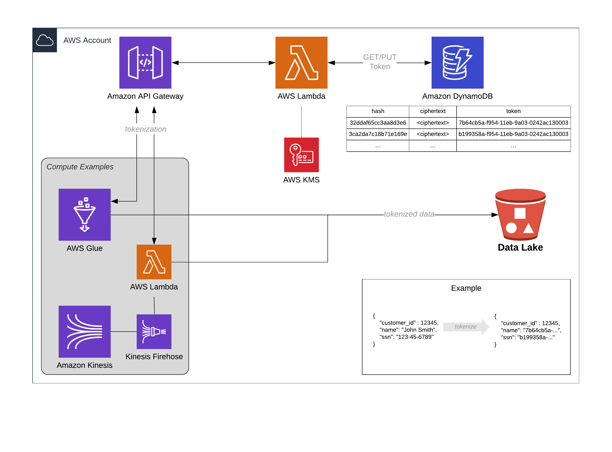

# AWS Serverless Tokenization Service

This repo contains a reference architecture for a serverless Data Tokenization microservice (nanoserverice?).

Data tokenization is an obfuscation method that replaces data values with a random token. This is often a part of a larger security strategy for highly sensitive data.

The token itself is random but it should be the **exact same** for exactly alike input values. Eg `123-45-6789` should *always* return the exact same token every time it is passed into the service.



## Components

### API Gateway
Serves as a proxy for the `tokenizer` lambda function

### Lambda
Performs the operations to either lookup or create entries in the `tokens` DynamoDB table

### KMS
CMK to encrypt the input string. Also provides ability to decrypt ciphertext values in `tokens` table to perform a reverse lookup

### DynamoDB
Contains the `tokens` table and serves as the token datastore.

#### Columns
 * `hash` - SHA256 hash of the original text and serves as the primary key of the table
 * `ciphertext` - KMS encrypted orginal value (in case of reverse tokenization needs)
 * `token` - random UUID4

## How It Works

This service performs tokenization by doing the following:
1. Input string is passed into the API GW via POST body
2. API request invokes the `tokenizer` lambda function
3. `tokenizer` lambda hashes the input string then checks DynamoDB if that hash value already exists. Based on that check it does one of the following:
  * If exists, return the token
  * If not exists, encrypt the original value, generate a random UUID4, and put these as a new item into the `tokens` table
4. Lambda returns the token

## How To Run

### Local

Using [Localstack](https://github.com/localstack/localstack) for local dev

This allows you to run the (AWS) cloud... on your local computer

```sh
docker compose up --build -d

cd envs/local

terraform init
terraform apply
```

Then you'll get a base_url output which will look something like `http://localhost:4566/restapis/<api_id>/local/_user_request_/tokenizer`

Hit that with cURL like
```sh
curl --location --request POST 'http://localhost:4566/restapis/<api_id>/local/_user_request_/tokenizer' \
--header 'Content-Type: text/plain' \
--data-raw '{"string": "secret data"}'
```

and you should get back a token. Hit it with the same value and you'll get the same token back as the previous request

### Dev
Actually deploy the thing in AWS

Assumes you have a valid profile in ~/.aws/credentials

Replace the s3 backend bucket with your own
